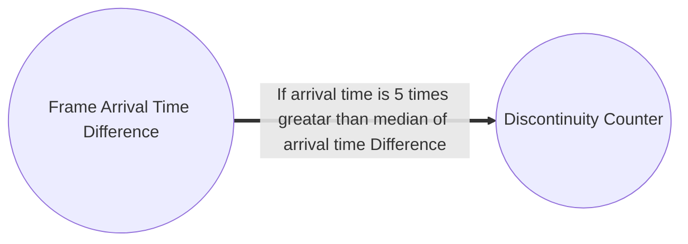
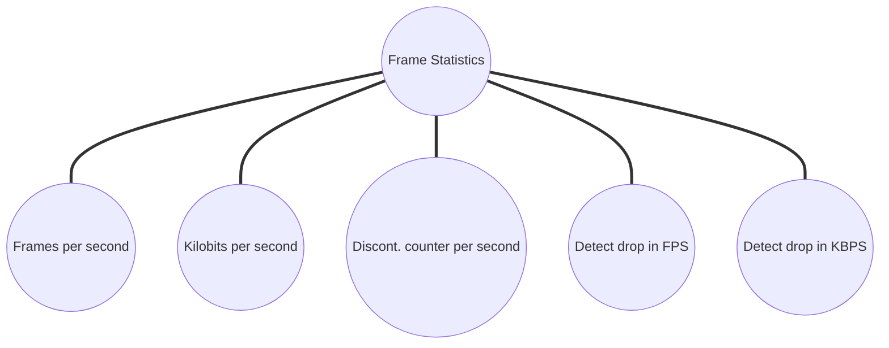

## Design

The function will be called per iteration.
This will server two purposes:
1. Frame Statistics.
1. On demand frame dump

```mermaid
flowchart LR
    frame_arrival_time_difference((Frame Arrival Time Difference)) == If arrival time is 5 times greatar than median of arrival time Difference ==> discontinuity_ps((Discontinuity Counter))
```

```mermaid
graph TD
    frame_statistics((Frame Statistics)) === fps((Frames per second))
    frame_statistics === kbps((Kilobits per second))
    frame_statistics === discontinuity_ps((Discont. counter per second))
    frame_statistics === drop_in_fps((Detect drop in FPS))
    frame_statistics === drop_in_kbps((Detect drop in KBPS))
```
